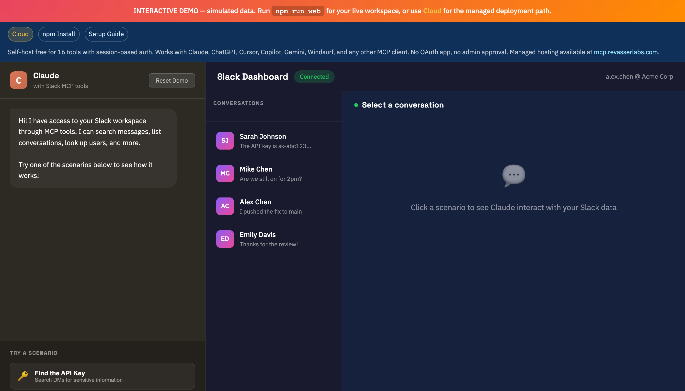

# Slack MCP Server

[](https://www.npmjs.com/package/slack-mcp-server)
[](https://opensource.org/licenses/MIT)
[](https://nodejs.org/)
[](https://ko-fi.com/jtalk22)

A [Model Context Protocol](https://modelcontextprotocol.io/) server that gives Claude full access to your Slack workspace - including **DMs**, channels, and message history.

<p align="center">
  
</p>

> **[Try the Interactive Demo](https://jtalk22.github.io/slack-mcp-server/public/demo.html)** - See the Web UI in action with mock data

## Why This Exists

Official Slack integrations require OAuth and can't access DMs without explicit per-conversation authorization. This server uses your browser session tokens to provide the same access you have in Slack's web interface.

**Works with:**
- Claude Desktop (macOS/Windows)
- Claude Code (CLI)
- claude.ai (via Web UI)

## Features

- **Read Messages** - Fetch history from any DM or channel
- **Full Export** - Export conversations with threads and resolved usernames
- **Search** - Search messages across your workspace
- **Send Messages** - Send to DMs or channels
- **Auto Token Recovery** - Refreshes expired tokens from Chrome automatically
- **Rate Limit Handling** - Automatic retry with exponential backoff
- **Web UI** - Browser interface for use with claude.ai

## Quick Start

### 1. Install

```bash
# Clone the repository
git clone https://github.com/jtalk22/slack-mcp-server.git
cd slack-mcp-server

# Install dependencies
npm install
```

Or install globally:
```bash
npm install -g slack-mcp-server
```

### 2. Get Your Slack Tokens

You need two tokens from your browser session:

**Option A: Automatic (Recommended)**
```bash
# Open Chrome with Slack (app.slack.com) logged in
npm run tokens:auto
```

**Option B: Manual**

1. Open https://app.slack.com in Chrome
2. Press F12 → Application → Cookies → Find `d` cookie (starts with `xoxd-`)
3. Press F12 → Console → Run:
   ```javascript
   JSON.parse(localStorage.localConfig_v2).teams[Object.keys(JSON.parse(localStorage.localConfig_v2).teams)[0]].token
   ```
4. Copy both values and run:
   ```bash
   npm run tokens:refresh
   ```

### 3. Configure Claude

#### For Claude Desktop

Edit `~/Library/Application Support/Claude/claude_desktop_config.json` (macOS) or `%APPDATA%\Claude\claude_desktop_config.json` (Windows):

```json
{
  "mcpServers": {
    "slack": {
      "command": "node",
      "args": ["/path/to/slack-mcp-server/src/server.js"],
      "env": {
        "SLACK_TOKEN": "xoxc-your-token",
        "SLACK_COOKIE": "xoxd-your-cookie"
      }
    }
  }
}
```

#### For Claude Code

Add to `~/.claude.json`:

```json
{
  "mcpServers": {
    "slack": {
      "type": "stdio",
      "command": "node",
      "args": ["/path/to/slack-mcp-server/src/server.js"]
    }
  }
}
```

Claude Code reads tokens from `~/.slack-mcp-tokens.json` automatically.

### 4. Restart Claude

The Slack tools will now be available.

## Available Tools

| Tool | Description |
|------|-------------|
| `slack_health_check` | Verify token validity and show workspace info |
| `slack_refresh_tokens` | Auto-extract fresh tokens from Chrome |
| `slack_list_conversations` | List DMs and channels with resolved names |
| `slack_conversations_history` | Get messages from a channel or DM |
| `slack_get_full_conversation` | Export full history with threads |
| `slack_search_messages` | Search across workspace |
| `slack_send_message` | Send a message |
| `slack_get_thread` | Get thread replies |
| `slack_users_info` | Get user details |
| `slack_list_users` | List workspace users |

## Web UI (for claude.ai)

Since claude.ai doesn't support MCP, you can use the web server:

```bash
npm run web
```

Open http://localhost:3000 in your browser. It auto-connects with the default API key (`slack-mcp-local`).

<details>
<summary><strong>View Web UI Screenshots</strong></summary>

| DMs View | Channels View |
|----------|---------------|
|  |  |

</details>

### Auto-Start on Login (macOS)

```bash
# Create LaunchAgent
cat > ~/Library/LaunchAgents/com.slack-mcp-server.plist << 'EOF'
<?xml version="1.0" encoding="UTF-8"?>
<!DOCTYPE plist PUBLIC "-//Apple//DTD PLIST 1.0//EN" "http://www.apple.com/DTDs/PropertyList-1.0.dtd">
<plist version="1.0">
<dict>
    <key>Label</key>
    <string>com.slack-mcp-server</string>
    <key>ProgramArguments</key>
    <array>
        <string>/usr/local/bin/node</string>
        <string>/path/to/slack-mcp-server/src/web-server.js</string>
    </array>
    <key>WorkingDirectory</key>
    <string>/path/to/slack-mcp-server</string>
    <key>RunAtLoad</key>
    <true/>
    <key>KeepAlive</key>
    <true/>
</dict>
</plist>
EOF

launchctl load ~/Library/LaunchAgents/com.slack-mcp-server.plist
```

## Token Management

Tokens are stored in multiple layers for reliability:

1. **Environment variables** - From MCP config
2. **Token file** - `~/.slack-mcp-tokens.json` (chmod 600)
3. **macOS Keychain** - Encrypted persistent storage
4. **Chrome auto-extraction** - Fallback when tokens expire

### When Tokens Expire

Tokens typically last 1-2 weeks. When they expire:

```bash
# Option 1: In Claude
slack_refresh_tokens

# Option 2: CLI
npm run tokens:auto
```

## Troubleshooting

### DMs Not Showing

This is handled automatically. The server discovers DMs by calling `conversations.open` for each user (Slack's `conversations.list` doesn't return DMs with browser tokens).

### Rate Limiting

The client implements automatic retry with exponential backoff. If you still hit limits, reduce batch sizes in your queries.

### Claude Desktop Not Seeing Tools

1. Verify JSON syntax in config
2. Check logs: `~/Library/Logs/Claude/mcp-server-slack.log`
3. Fully restart Claude Desktop (Cmd+Q, then reopen)

### Chrome Extraction Fails

- Chrome must be running (not just in Dock)
- Have a Slack tab open at `app.slack.com`
- Be logged into Slack

## How It Works

This server uses Slack's internal Web API with browser session tokens (`xoxc-` token and `xoxd-` cookie). This provides the same access level as the Slack web interface.

**Why not a Slack App?**

Slack apps require OAuth and cannot access DMs without explicit per-conversation authorization from users. Browser tokens bypass this limitation.

**Trade-offs:**
- ✅ Full access to all conversations
- ✅ No per-conversation authorization
- ❌ Tokens expire every 1-2 weeks
- ❌ Requires Chrome for token extraction
- ❌ Not officially supported by Slack

## Security Notes

- Tokens are stored with `chmod 600` (owner read/write only)
- macOS Keychain provides encrypted storage
- Never commit tokens to version control
- Web server only accessible on localhost by default

## Project Structure

```
slack-mcp-server/
├── src/
│   ├── server.js         # MCP server entry point
│   └── web-server.js     # REST API + Web UI
├── lib/
│   ├── token-store.js    # 4-layer token persistence
│   ├── slack-client.js   # API client with retry logic
│   ├── tools.js          # MCP tool definitions
│   └── handlers.js       # Tool implementations
├── public/
│   ├── index.html        # Web UI
│   └── demo.html         # Interactive demo with mock data
├── scripts/
│   └── token-cli.js      # Token management CLI
└── docs/
    ├── images/           # Screenshots
    ├── SETUP.md          # Detailed setup guide
    ├── API.md            # Tool reference
    ├── WEB-API.md        # REST API reference
    └── TROUBLESHOOTING.md
```

## Contributing

Contributions welcome! Please:

1. Fork the repository
2. Create a feature branch
3. Make your changes
4. Submit a pull request

## Support

If you find this useful, consider supporting the project:

- [GitHub Sponsors](https://github.com/sponsors/jtalk22)
- [Ko-fi](https://ko-fi.com/jtalk22)
- [Buy Me a Coffee](https://www.buymeacoffee.com/jtalk22)

Star the repo if it helped you!

## License

MIT - See [LICENSE](LICENSE) for details.

## Disclaimer

This project uses unofficial Slack APIs. Use at your own risk. The authors are not responsible for any account issues that may arise from using this software.
