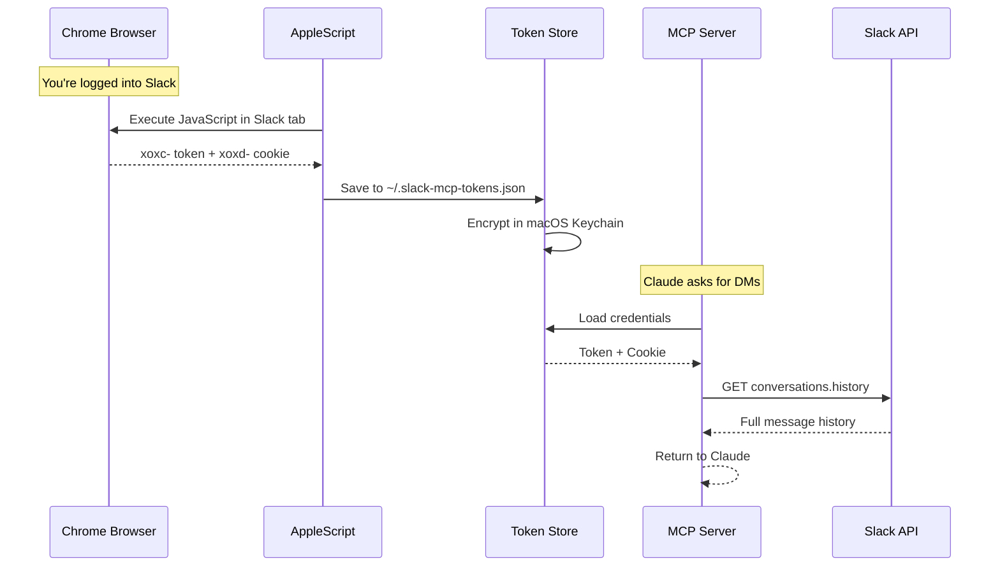
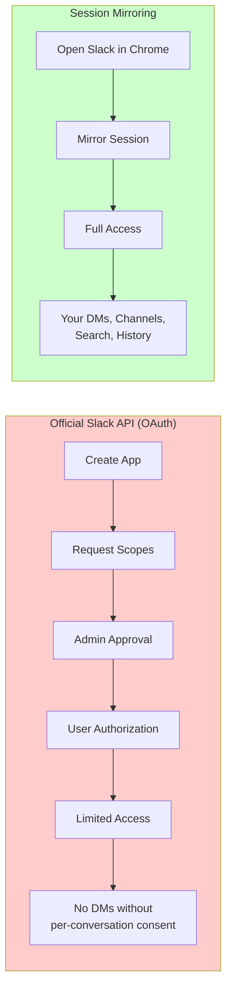

# Slack MCP Server

*Full workspace access via local session mirroring. DMs, threads, and history—no admin approval required.*

[](https://jtalk22.github.io/slack-mcp-server/public/demo.html)

[](https://www.npmjs.com/package/@jtalk22/slack-mcp)
[](https://github.com/jtalk22/slack-mcp-server/pkgs/container/slack-mcp-server)
[](https://opensource.org/licenses/MIT)
[](https://nodejs.org/)
[](https://github.com/sponsors/jtalk22)

---

### Why This Exists

I built this because I was working with someone to help me manage a complex workload, and we kept hitting walls. They needed context from my messages—"what did X say about Y?"—but Slack's API blocks access to DMs without admin approval.

Screenshotting messages is not a workflow.

This server bridges the gap. It creates a secure, local bridge between Claude and your Slack web session. It gives your AI the same access **you** already have in the browser—search history, summarize threads, find that thing someone sent you three weeks ago—without fighting the platform.


> **[Try the Interactive Demo](https://jtalk22.github.io/slack-mcp-server/public/demo.html)** - See the Web UI in action

---

## Architecture: Local Session Mirroring

Instead of authenticating as a bot, this server leverages your existing Chrome session credentials (macOS) or manual token injection (Linux/Windows). It mirrors your user access exactly—if you can see it in Slack, Claude can see it too.



### Why Not OAuth?



**Trade-off:** Session tokens expire every 1-2 weeks. Auto-refresh (macOS) or manual update keeps things running.

---

## Features

### Core Capabilities
- **Read Any Message** - DMs, private channels, public channels
- **Full Export** - Conversations with threads and resolved usernames
- **Search** - Query across your entire workspace
- **Send Messages** - DMs or channels, with thread support
- **User Directory** - List and search 500+ users with pagination

### Stability (v1.0.6+)
- **Auto Token Refresh** - Extracts fresh tokens from Chrome automatically *(macOS only)*
- **Atomic Writes** - File operations use temp-file-then-rename to prevent corruption
- **Zombie Protection** - Background timers use `unref()` for clean process exit
- **Race Condition Safety** - Mutex locks prevent concurrent token extraction
- **Rate Limit Handling** - Exponential backoff with jitter

### Tools
| Tool | Description |
|------|-------------|
| `slack_health_check` | Verify token validity and workspace info |
| `slack_token_status` | **New:** Detailed token age, health, and cache stats |
| `slack_refresh_tokens` | Auto-extract fresh tokens from Chrome |
| `slack_list_conversations` | List DMs/channels (with lazy discovery cache) |
| `slack_conversations_history` | Get messages from a channel or DM |
| `slack_get_full_conversation` | Export full history with threads |
| `slack_search_messages` | Search across workspace |
| `slack_send_message` | Send a message to any conversation |
| `slack_get_thread` | Get thread replies |
| `slack_users_info` | Get user details |
| `slack_list_users` | List workspace users (paginated, 500+ supported) |

---

## Quick Start

### Option A: npm (Recommended)

```bash
npm install -g @jtalk22/slack-mcp
```

### Option B: Clone Repository

```bash
git clone https://github.com/jtalk22/slack-mcp-server.git
cd slack-mcp-server
npm install
```

### Option C: Docker

```bash
docker pull ghcr.io/jtalk22/slack-mcp-server:latest
```

---

## Configuration

### Step 1: Get Your Tokens

#### macOS (Automatic)
```bash
# Have Chrome open with Slack (app.slack.com) logged in
npx @jtalk22/slack-mcp tokens:auto
# Or if cloned: npm run tokens:auto
```

#### Linux/Windows (Manual)

Auto-refresh requires macOS + Chrome. On other platforms, extract tokens manually:

1. Open https://app.slack.com in your browser
2. Press F12 → Console → Run:
   ```javascript
   // Get token
   JSON.parse(localStorage.localConfig_v2).teams[Object.keys(JSON.parse(localStorage.localConfig_v2).teams)[0]].token
   ```
3. Press F12 → Application → Cookies → Copy the `d` cookie value (starts with `xoxd-`)
4. Create `~/.slack-mcp-tokens.json`:
   ```json
   {
     "SLACK_TOKEN": "xoxc-your-token-here",
     "SLACK_COOKIE": "xoxd-your-cookie-here",
     "updated_at": "2024-01-01T00:00:00.000Z"
   }
   ```

### Step 2: Configure Claude

#### Claude Desktop (macOS)

Edit `~/Library/Application Support/Claude/claude_desktop_config.json`:

```json
{
  "mcpServers": {
    "slack": {
      "command": "npx",
      "args": ["-y", "@jtalk22/slack-mcp"]
    }
  }
}
```

#### Claude Desktop (Windows)

Edit `%APPDATA%\Claude\claude_desktop_config.json`:

```json
{
  "mcpServers": {
    "slack": {
      "command": "npx",
      "args": ["-y", "@jtalk22/slack-mcp"],
      "env": {
        "SLACK_TOKEN": "xoxc-your-token",
        "SLACK_COOKIE": "xoxd-your-cookie"
      }
    }
  }
}
```

> **Note:** Windows/Linux users must provide tokens via `env` since auto-refresh is macOS-only.

#### Claude Code (CLI)

Add to `~/.claude.json`:

```json
{
  "mcpServers": {
    "slack": {
      "type": "stdio",
      "command": "npx",
      "args": ["-y", "@jtalk22/slack-mcp"]
    }
  }
}
```

Claude Code reads tokens from `~/.slack-mcp-tokens.json` automatically.

#### Docker Configuration

```json
{
  "mcpServers": {
    "slack": {
      "command": "docker",
      "args": ["run", "-i", "--rm",
               "-v", "~/.slack-mcp-tokens.json:/root/.slack-mcp-tokens.json",
               "ghcr.io/jtalk22/slack-mcp-server"]
    }
  }
}
```

### Step 3: Restart Claude

Fully quit and reopen Claude. The Slack tools will appear.

---

## Architecture

### Token Persistence (4 Layers)

```
Priority 1: Environment Variables (SLACK_TOKEN, SLACK_COOKIE)
    ↓ fallback
Priority 2: Token File (~/.slack-mcp-tokens.json)
    ↓ fallback
Priority 3: macOS Keychain (encrypted)
    ↓ fallback
Priority 4: Chrome Auto-Extraction (macOS only)
```

### Stability Features

#### Atomic Writes
All file operations (tokens, DM cache) use atomic writes:
```
Write to temp file → chmod 600 → rename to target
```
This prevents JSON corruption if the process is killed mid-write.

#### Zombie Process Protection
Background refresh timers use `unref()`:
```javascript
const timer = setInterval(refreshTokens, 4 * 60 * 60 * 1000);
timer.unref(); // Process can exit even if timer is pending
```
When Claude closes the MCP connection, the server exits cleanly.

#### Race Condition Prevention
A mutex lock prevents concurrent Chrome extractions:
```javascript
if (refreshInProgress) return null; // Skip if already refreshing
refreshInProgress = true;
try { return extractFromChromeInternal(); }
finally { refreshInProgress = false; }
```

---

## Web UI (for claude.ai)

Since claude.ai doesn't support MCP, use the REST server:

```bash
npm run web
# Or: npx @jtalk22/slack-mcp web
```

**Magic Link (v1.1.0+):** The console prints a one-click URL with the API key embedded:

```
════════════════════════════════════════════════════════════
  Slack Web API Server v1.1.0
════════════════════════════════════════════════════════════

  Dashboard: http://localhost:3000/?key=smcp_xxxxxxxxxxxx
```

Just click the link - no copy-paste needed. The key is saved to your browser and stripped from the URL for security.

<details>
<summary><strong>Screenshots</strong></summary>

| DMs View | Channels View |
|----------|---------------|
|  |  |

</details>

---

## Troubleshooting

### Tokens Expired
```bash
# macOS: Auto-refresh from Chrome
slack_refresh_tokens  # In Claude
# Or: npm run tokens:auto

# Linux/Windows: Manual update
# Edit ~/.slack-mcp-tokens.json with fresh values
```

### DMs Not Showing
Use `discover_dms: true` to force discovery:
```
slack_list_conversations with discover_dms=true
```
This caches DM channel IDs for 24 hours.

### Chrome Extraction Fails
- Chrome must be **running** (not minimized to Dock)
- Slack tab must be open at `app.slack.com`
- You must be logged in

### Claude Desktop Not Seeing Tools
1. Verify JSON syntax in config file
2. Check logs: `~/Library/Logs/Claude/mcp*.log`
3. Fully restart Claude (Cmd+Q, then reopen)

---

## Project Structure

```
slack-mcp-server/
├── src/
│   ├── server.js         # MCP server (stdio transport)
│   └── web-server.js     # REST API + Web UI
├── lib/
│   ├── token-store.js    # 4-layer persistence + atomic writes
│   ├── slack-client.js   # API client, LRU cache, retry logic
│   ├── tools.js          # MCP tool definitions
│   └── handlers.js       # Tool implementations
├── public/
│   ├── index.html        # Web UI
│   └── demo.html         # Interactive demo
└── scripts/
    └── token-cli.js      # Token management CLI
```

---

## Security

- Token files stored with `chmod 600` (owner-only)
- macOS Keychain provides encrypted backup
- Web server binds to localhost only
- Never commit tokens to version control
- API keys are cryptographically random (`crypto.randomBytes`)

---

## Platform Support

| Feature | macOS | Linux | Windows |
|---------|-------|-------|---------|
| MCP Server | Yes | Yes | Yes |
| Token File | Yes | Yes | Yes |
| Auto-Refresh from Chrome | Yes | No | No |
| Keychain Storage | Yes | No | No |
| Web UI | Yes | Yes | Yes |

---

## Contributing

1. Fork the repository
2. Create a feature branch
3. Make your changes
4. Run `node --check` on modified files
5. Submit a pull request

---

## Support

If this saved you from OAuth hell, consider:

- [GitHub Sponsors](https://github.com/sponsors/jtalk22)
- Star the repo

---

## License

MIT - See [LICENSE](LICENSE)

---

## Disclaimer

This project uses unofficial Slack APIs. Use at your own risk. Not affiliated with or endorsed by Slack Technologies.
