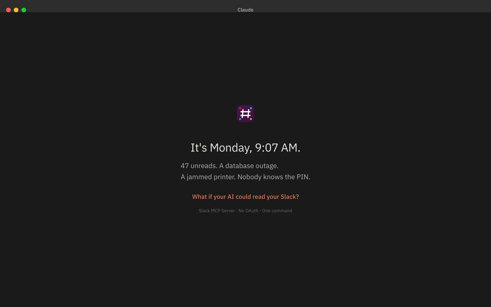
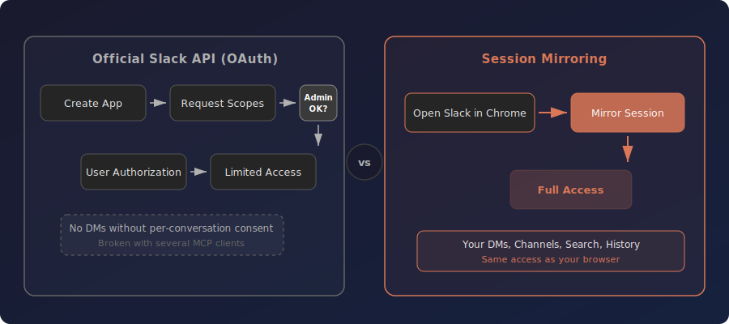

# Slack MCP Server

[](https://www.npmjs.com/package/@jtalk22/slack-mcp)
[](https://registry.modelcontextprotocol.io)
[](https://opensource.org/licenses/MIT)

Give your AI agent full Slack access. No app registration, no admin approval, no OAuth. One command, 16 tools, works with any MCP client.

```bash
npx -y @jtalk22/slack-mcp --setup
```

[](https://jtalk22.github.io/slack-mcp-server/public/demo-video.html)

**[▶ Watch the demo](https://jtalk22.github.io/slack-mcp-server/public/demo-video.html)** — 7 scenarios, from 47 unreads to inbox zero, without opening Slack.

> **Ask your AI to catch you up on #engineering from the last 24 hours.** Search for that deployment thread from last week. Find the printer admin PIN nobody can remember. Send a reply. All from your editor.

[Interactive demo](https://jtalk22.github.io/slack-mcp-server/public/demo-claude.html) · [Latest release](https://github.com/jtalk22/slack-mcp-server/releases/latest)

## Why This Exists

Slack's official MCP server requires a registered app, admin approval, and [doesn't work with Claude Code or GitHub Copilot](https://github.com/anthropics/claude-code/issues/30564) due to OAuth/DCR incompatibility. Screenshotting messages is not a workflow.

This server uses your browser's session tokens instead. If you can see it in Slack, your AI agent can see it too. No app install, no scopes, no admin.



|  | Slack Official MCP | This Server |
|---|---|---|
| OAuth app required | Yes | **No** |
| Admin approval | Yes | **No** |
| Works with Claude Code | No (DCR incompatible) | **Yes** |
| Works with Copilot | No | **Yes** |
| Setup time | ~30 min | **~2 min** |
| Tools | Limited | **16** |

## Tools

| Tool | Description | Safety |
|------|-------------|--------|
| `slack_health_check` | Verify token validity and workspace info | read-only |
| `slack_token_status` | Token age, health, and cache stats | read-only |
| `slack_refresh_tokens` | Auto-extract fresh tokens from Chrome | read-only* |
| `slack_list_conversations` | List DMs and channels | read-only |
| `slack_conversations_history` | Get messages from a channel or DM | read-only |
| `slack_get_full_conversation` | Export full history with threads | read-only |
| `slack_search_messages` | Search across workspace | read-only |
| `slack_get_thread` | Get thread replies | read-only |
| `slack_users_info` | Get user details | read-only |
| `slack_list_users` | List workspace users (paginated, 500+) | read-only |
| `slack_users_search` | Search users by name, display name, or email | read-only |
| `slack_conversations_unreads` | Get channels/DMs with unread messages | read-only |
| `slack_send_message` | Send a message to any conversation | **destructive** |
| `slack_add_reaction` | Add an emoji reaction to a message | **destructive** |
| `slack_remove_reaction` | Remove an emoji reaction from a message | **destructive** |
| `slack_conversations_mark` | Mark a conversation as read | **destructive** |

12 read-only, 4 write-path. All carry [MCP safety annotations](https://modelcontextprotocol.io/specification/2025-03-26/server/tools#annotations).

\* `slack_refresh_tokens` modifies local token file only.

## Install

**Node.js 20+**

```bash
npx -y @jtalk22/slack-mcp --setup
```

The setup wizard handles token extraction and validation.

<details>
<summary><strong>Claude Desktop (macOS)</strong></summary>

Edit `~/Library/Application Support/Claude/claude_desktop_config.json`:

```json
{
  "mcpServers": {
    "slack": {
      "command": "npx",
      "args": ["-y", "@jtalk22/slack-mcp"]
    }
  }
}
```

</details>

<details>
<summary><strong>Claude Desktop (Windows/Linux)</strong></summary>

Edit `%APPDATA%\Claude\claude_desktop_config.json`:

```json
{
  "mcpServers": {
    "slack": {
      "command": "npx",
      "args": ["-y", "@jtalk22/slack-mcp"],
      "env": {
        "SLACK_TOKEN": "xoxc-your-token",
        "SLACK_COOKIE": "xoxd-your-cookie"
      }
    }
  }
}
```

> Windows/Linux users must provide tokens via `env` since auto-refresh is macOS-only.

</details>

<details>
<summary><strong>Claude Code</strong></summary>

Add to `~/.claude.json`:

```json
{
  "mcpServers": {
    "slack": {
      "type": "stdio",
      "command": "npx",
      "args": ["-y", "@jtalk22/slack-mcp"]
    }
  }
}
```

</details>

<details>
<summary><strong>Cursor / Copilot / Other MCP clients</strong></summary>

Any client that supports stdio MCP servers works. Add to your client's MCP config:

```json
{
  "slack": {
    "command": "npx",
    "args": ["-y", "@jtalk22/slack-mcp"],
    "env": {
      "SLACK_TOKEN": "xoxc-your-token",
      "SLACK_COOKIE": "xoxd-your-cookie"
    }
  }
}
```

On macOS, tokens are auto-extracted from Chrome — `env` block is optional.

</details>

<details>
<summary><strong>Claude Web / Remote MCP</strong></summary>

For browser-based clients that can't run local processes, use the hosted HTTP endpoint:

```
https://mcp.revasserlabs.com/oauth/mcp
```

Add this as a remote MCP server in your client's settings. Transport: Streamable HTTP. Auth: OAuth 2.1 + PKCE.

</details>

<details>
<summary><strong>Docker</strong></summary>

```bash
docker pull ghcr.io/jtalk22/slack-mcp-server:latest
```

```json
{
  "mcpServers": {
    "slack": {
      "command": "docker",
      "args": ["run", "-i", "--rm",
               "-v", "~/.slack-mcp-tokens.json:/root/.slack-mcp-tokens.json",
               "ghcr.io/jtalk22/slack-mcp-server"]
    }
  }
}
```

</details>

Restart your client after configuration. Full setup: [docs/SETUP.md](docs/SETUP.md)

## How It Works

Session tokens (`xoxc-` + `xoxd-`) from your browser. If you can see it in Slack, this server can see it too.

**Token persistence** — four-layer fallback:
1. Environment variables (`SLACK_TOKEN`, `SLACK_COOKIE`)
2. Token file (`~/.slack-mcp-tokens.json`, chmod 600)
3. macOS Keychain (encrypted)
4. Chrome auto-extraction (macOS)

Tokens expire. The server notices before you do — proactive health monitoring, automatic refresh on macOS, warnings when tokens age out. File writes are atomic (temp file → chmod → rename) to prevent corruption. Concurrent refresh attempts are mutex-locked.

## Hosted HTTP Mode

For remote MCP endpoints (Cloudflare Worker, VPS, etc.):

```bash
SLACK_TOKEN=xoxc-... \
SLACK_COOKIE=xoxd-... \
SLACK_MCP_HTTP_AUTH_TOKEN=change-this \
SLACK_MCP_HTTP_ALLOWED_ORIGINS=https://claude.ai \
node src/server-http.js
```

Details: [docs/DEPLOYMENT-MODES.md](docs/DEPLOYMENT-MODES.md)

## Troubleshooting

**Tokens expired:** Run `npx -y @jtalk22/slack-mcp --setup` or use `slack_refresh_tokens` (macOS).

**DMs not showing:** Use `slack_list_conversations` with `discover_dms=true`.

**Client not seeing tools:** Check JSON syntax in config, restart client fully.

More: [docs/TROUBLESHOOTING.md](docs/TROUBLESHOOTING.md)

## Docs

- [Setup Guide](docs/SETUP.md)
- [API Reference](docs/API.md)
- [Architecture](docs/ARCHITECTURE.md)
- [Deployment Modes](docs/DEPLOYMENT-MODES.md)
- [Use Case Recipes](docs/USE_CASE_RECIPES.md)
- [Troubleshooting](docs/TROUBLESHOOTING.md)
- [Compatibility](docs/COMPATIBILITY.md)

## Security

- Token files: `chmod 600` (owner-only)
- macOS Keychain encrypted backup
- Web server binds to localhost only
- API keys: `crypto.randomBytes`
- See [SECURITY.md](SECURITY.md)

## Contributing

PRs welcome. Run `node --check` on modified files before submitting.

## License

MIT — See [LICENSE](LICENSE)

## Disclaimer

Not affiliated with Slack Technologies, Inc. Uses browser session credentials — check your workspace's acceptable use policy.

---

Managed hosting available — [mcp.revasserlabs.com](https://mcp.revasserlabs.com)
