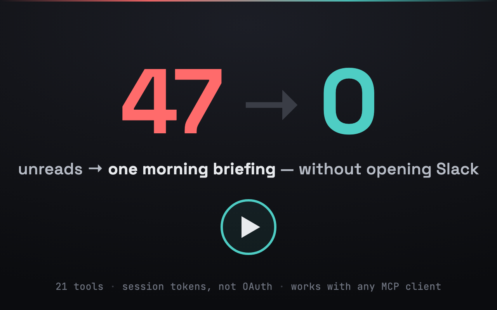
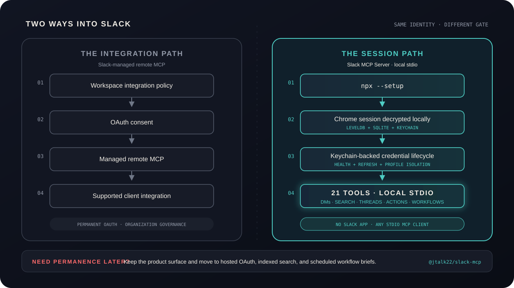
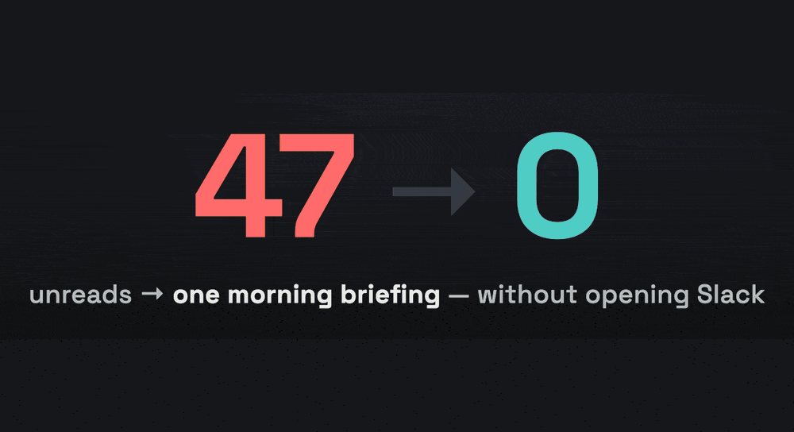
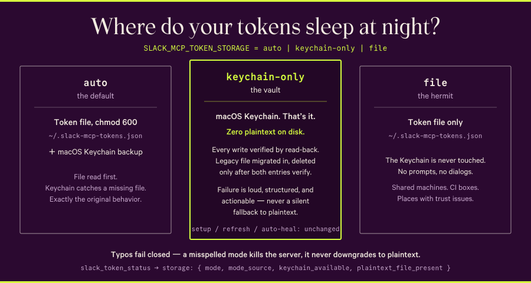

<div align="center">

<h1>Slack MCP Server</h1>

<h3>Slack for your AI agent — no OAuth, no admin, no app to register.</h3>

<p>
  <a href="https://www.npmjs.com/package/@jtalk22/slack-mcp"></a>
  <a href="https://www.npmjs.com/package/@jtalk22/slack-mcp"></a>
  <a href="https://github.com/jtalk22/slack-mcp-server/actions/workflows/ci.yml"></a>
  <a href="https://registry.modelcontextprotocol.io"></a>
  <a href="https://opensource.org/licenses/MIT"></a>
  <a href="https://github.com/jtalk22/slack-mcp-server"></a>
</p>

<p>
  <kbd>Claude Code</kbd> <kbd>Claude Desktop</kbd> <kbd>Cursor</kbd> <kbd>Copilot</kbd> <kbd>Windsurf</kbd> <kbd>Gemini CLI</kbd> <kbd>Codex CLI</kbd>
</p>

<p><b>If you can read it in Slack, your agent can read it too.</b> It borrows the session tokens your browser already holds — no registered app, no scope review, no admin in the loop. 21 tools. One command:</p>

</div>

```bash
npx -y @jtalk22/slack-mcp --setup
```

<div align="center">

<a href="https://jtalk22.github.io/slack-mcp-server/public/demo-video.html">
  
</a>

<p><sub><b><a href="https://jtalk22.github.io/slack-mcp-server/public/demo-video.html">▶ Watch the full 3:24 demo — with chapters</a></b> · <a href="https://jtalk22.github.io/slack-mcp-server/public/demo-slack-mcp.html">interactive demo</a> · <a href="docs/SETUP.md">setup guide</a></sub></p>

</div>

<p align="center">
  <a href="#the-trick-session-tokens-not-oauth">Why no OAuth</a> ·
  <a href="#install">Install</a> ·
  <a href="#the-21-tools">The 21 tools</a> ·
  <a href="#workflows-slack-in-typed-json-out">Workflows</a> ·
  <a href="#how-token-storage-works">Token storage</a> ·
  <a href="#hosted-optional--the-oss-package-is-complete-without-it">Hosted</a>
</p>

---

## The trick: session tokens, not OAuth

Slack's official MCP server is OAuth-first — a registered app, admin approval, and (for several clients) compatibility workarounds that don't exist yet (see the tracked [Claude Code / Copilot DCR discussion](https://github.com/anthropics/claude-code/issues/30564)). For a lot of people the "integration" quietly degrades into screenshotting messages into a chat window. That isn't an integration.

So this server does the obvious thing instead: it reads the `xoxc-` + `xoxd-` session tokens your browser is already holding and speaks Slack's own API with them. No app install, no scopes to request, no admin in the loop — and because there's no bot user and no installed app, nothing appears in the workspace admin panel. Your agent's footprint is exactly your open browser tab's: no more, no less.

<div align="center">

</div>

|                          | Slack Official MCP        | **This Server**                 |
| ------------------------ | ------------------------- | ------------------------------- |
| OAuth app required       | Yes                       | **No**                          |
| Admin approval           | Yes                       | **No**                          |
| Claude Code · Cursor · Copilot · Windsurf · Gemini CLI · Codex CLI | Blocked or partial (DCR) | **All six, today** |
| Setup time               | ~30 min                   | **~2 min**                      |
| Tools                    | Limited                   | **21**                          |
| Visible to admins        | Yes                       | **No — session-token transport** |

<sub>Same permissions either way — your agent sees exactly what you see. The difference is who has to approve it.</sub>

<details>
<summary><b>Is this against Slack's terms?</b></summary>
<br>

Honest answer: it's a gray area, and you should know exactly what this does before you run it. This server automates <i>your own session</i> — the same class of thing as a browser extension or a userscript. It grants your agent nothing you don't already have: it can't read a channel you can't read, join a workspace you're not in, or act as anyone but you. There is no permission escalation anywhere in this codebase — just your cookie, used from your machine.

What it does <i>not</i> do: it does not evade compliance exports, DLP, or retention. Those run server-side at Slack and see this traffic like any other client's. "Invisible to admins" means there is no <i>app install</i> to review — not that your messages stop being subject to workspace policy.

If your workspace's acceptable-use policy forbids unofficial clients, respect it — the OAuth-based <a href="https://mcp.revasserlabs.com">hosted version</a> exists for exactly that case.
</details>

---

## Watch it run

<div align="center">

<a href="https://jtalk22.github.io/slack-mcp-server/public/demo-video.html">
  
</a>

<p><sub>A real session at 2× — unread counts → history pull → the briefing. <a href="https://jtalk22.github.io/slack-mcp-server/public/demo-video.html">Full 3:24 with chapters →</a></sub></p>

</div>

---

## Install

**Node.js 20+.** One command extracts your tokens, validates them, and remembers where to keep them:

```bash
npx -y @jtalk22/slack-mcp --setup
```

Register the server with your client, restart it, then ask your agent to run `slack_health_check` — a workspace name in the reply means you're live. Pick your client:

<details>
<summary><strong>Claude Code</strong></summary>

Add to `~/.claude.json`:

```json
{
  "mcpServers": {
    "slack": { "type": "stdio", "command": "npx", "args": ["-y", "@jtalk22/slack-mcp"] }
  }
}
```

Or in one line: `claude mcp add slack -- npx -y @jtalk22/slack-mcp`

</details>

<details>
<summary><strong>Claude Desktop</strong></summary>

**macOS** — `~/Library/Application Support/Claude/claude_desktop_config.json`
**Windows / Linux** — `%APPDATA%\Claude\claude_desktop_config.json`

```json
{
  "mcpServers": {
    "slack": { "command": "npx", "args": ["-y", "@jtalk22/slack-mcp"] }
  }
}
```

> On Windows and Linux, auto-refresh is unavailable — supply tokens explicitly with an `"env": { "SLACK_TOKEN": "xoxc-…", "SLACK_COOKIE": "xoxd-…" }` block.

</details>

<details>
<summary><strong>Cursor</strong></summary>

Add to `.cursor/mcp.json`:

```json
{
  "mcpServers": {
    "slack": { "command": "npx", "args": ["-y", "@jtalk22/slack-mcp"] }
  }
}
```

</details>

<details>
<summary><strong>GitHub Copilot (VS Code)</strong></summary>

Add to `.vscode/mcp.json`:

```json
{
  "servers": {
    "slack": { "command": "npx", "args": ["-y", "@jtalk22/slack-mcp"] }
  }
}
```

</details>

<details>
<summary><strong>Windsurf</strong></summary>

Add to `~/.codeium/windsurf/mcp_config.json`:

```json
{
  "mcpServers": {
    "slack": { "command": "npx", "args": ["-y", "@jtalk22/slack-mcp"] }
  }
}
```

</details>

<details>
<summary><strong>Gemini CLI</strong></summary>

Add to `~/.gemini/settings.json`:

```json
{
  "mcpServers": {
    "slack": { "command": "npx", "args": ["-y", "@jtalk22/slack-mcp"] }
  }
}
```

</details>

<details>
<summary><strong>Codex CLI</strong></summary>

Add to `~/.codex/config.toml`:

```toml
[mcp_servers.slack]
command = "npx"
args = ["-y", "@jtalk22/slack-mcp"]
```

Or via CLI: `codex mcp add slack -- npx -y @jtalk22/slack-mcp`

</details>

<details>
<summary><strong>Any other stdio MCP client</strong></summary>

Anything that speaks stdio MCP works — point it at `npx -y @jtalk22/slack-mcp`. On macOS, tokens auto-extract from Chrome (no `env` block needed); elsewhere, pass `SLACK_TOKEN` / `SLACK_COOKIE` via `env`.

</details>

<details>
<summary><strong>Docker</strong></summary>

```bash
docker pull ghcr.io/jtalk22/slack-mcp-server:latest
```

```json
{
  "mcpServers": {
    "slack": {
      "command": "docker",
      "args": ["run", "-i", "--rm",
               "-v", "~/.slack-mcp-tokens.json:/root/.slack-mcp-tokens.json",
               "ghcr.io/jtalk22/slack-mcp-server"]
    }
  }
}
```

</details>

Full walkthrough — including the optional keep-tokens-fresh LaunchAgent — in **[docs/SETUP.md](docs/SETUP.md)**.

---

## The 21 tools

Every workspace write-path tool carries an [MCP destructive annotation](https://modelcontextprotocol.io/specification/2025-03-26/server/tools#annotations) so clients can gate it.

| Tool | Description | Safety |
| ---- | ----------- | ------ |
| **Read the workspace — 12 read-only tools** | | |
| `slack_health_check` | Verify token validity and workspace info | read-only |
| `slack_token_status` | Token age, health, and cache stats | read-only |
| `slack_refresh_tokens` | Auto-extract fresh tokens from Chrome | read-only\* |
| `slack_list_conversations` | List DMs and channels | read-only |
| `slack_conversations_history` ‡ | Get messages from a channel or DM | read-only |
| `slack_get_full_conversation` ‡ | Export full history with threads | read-only |
| `slack_search_messages` ‡ | Search across the workspace | read-only |
| `slack_get_thread` ‡ | Get thread replies | read-only |
| `slack_users_info` | Get user details | read-only |
| `slack_list_users` | List workspace users (paginated, 500+) | read-only |
| `slack_users_search` | Search users by name, display name, or email | read-only |
| `slack_conversations_unreads` | Get channels/DMs with unread messages | read-only |
| **Act in the workspace — 4 write-path tools, all annotated destructive** | | |
| `slack_send_message` | Send a message to any conversation | **destructive** |
| `slack_add_reaction` | Add an emoji reaction to a message | **destructive** |
| `slack_remove_reaction` | Remove an emoji reaction from a message | **destructive** |
| `slack_conversations_mark` | Mark a conversation as read | **destructive** |
| **Workflow profiles — 2 tools, local JSON** | | |
| `slack_workflow_save` | Save a workflow profile to `~/.slack-mcp-workflows.json` | local-write |
| `slack_workflows` | List saved workflow profiles | read-only |
| **Hosted-brain stubs — 3 tools** | | |
| `slack_smart_search` | Semantic search across indexed channels | hosted-stub† |
| `slack_catch_me_up` | AI-summarized digest of unreads + priority threads | hosted-stub† |
| `slack_triage` | Prioritized action queue across channels | hosted-stub† |

<sub>\* `slack_refresh_tokens` writes the local token file only. † Hosted stubs return a structured upgrade payload (`signup_url`, `free_tier_quota`, `pro_value_prop`) — no Slack call happens from OSS. ‡ Accepts `include_rich_message_fields` — see [Rich message fields](#rich-message-fields).</sub>

---

## Workflows: Slack in, typed JSON out

Reading messages is table stakes. The primitives turn Slack into a **typed data source your automation can consume directly.** Bind a `workflow_kind` to a set of channels, priority people, retention, and cadence with `slack_workflow_save` (stored locally at `~/.slack-mcp-workflows.json`). The [hosted brain](https://mcp.revasserlabs.com) reads those profiles and returns structured JSON per kind — no prompt-parsing, no scraping, feed it straight into Linear, Notion, or a status dashboard.

| `workflow_kind` | Returns |
| --------------- | ------- |
| `incident_room` | `{incident_summary, timeline, open_risks, owner_gaps, next_actions}` |
| `exec_brief` | `{summary, decisions, risks, asks, action_items}` |
| `support_inbox` | `{open_threads, ack_lag, owner_gaps, escalations, next_actions}` |
| `product_launch_watch` | `{launch_signals, feedback_themes, blockers, metrics, next_actions}` |
| `custom` | `{summary, highlights, open_questions, next_actions}` |

Six ready-to-fork templates ship in the box:

```bash
npx -y @jtalk22/slack-mcp --apply-template oncall-handoff --channels C012345,C067890
```

`oncall-handoff` · `support-triage` · `exec-monday` · `sprint-tracker` · `customer-feedback` · `incident-room` — plain JSON profiles you can read and edit. The primitives (`slack_workflow_save`, `slack_workflows`) are **free forever in OSS**; only the AI summarization runs on the hosted brain.

Copy-paste prompt recipes — summarize a channel, search for decisions, export a thread — live in [docs/USE_CASE_RECIPES.md](docs/USE_CASE_RECIPES.md).

---

## Rich message fields

The four read tools marked ‡ accept `include_rich_message_fields: true`, surfacing everything that lives *outside* a message's `text`: `attachments`, `blocks`, `files`, `reactions`, `metadata`, plus `subtype` / `bot_id` / `app_id` (bot & app markers) and `team` (workspace id).

An attachment-only alert looks empty without it:

```json
{ "ts": "1767368030.607599", "user": "incident-bot", "text": "" }
```

With the flag, the real content appears:

```json
{
  "ts": "1767368030.607599",
  "user": "incident-bot",
  "text": "",
  "subtype": "bot_message",
  "bot_id": "B012345",
  "attachments": [{ "title": "PagerDuty", "text": "P1 — API latency > 2s" }]
}
```

Output shape only — no extra permissions. `blocks` can be large, so it's opt-in per call to keep client context lean; for the full developer payload inside `metadata`, also set `include_all_metadata: true`.

One caveat: Slack's search API doesn't return rich fields on matches — `slack_search_messages` finds the hit, then `slack_conversations_history` or `slack_get_thread` reads the full content.

Added in 4.4.0 · patch by [@rvandam](https://github.com/rvandam) (#143).

---

## How token storage works

Session tokens (`xoxc-` + `xoxd-`) come from your browser. The server resolves them through a four-layer fallback, first hit wins:

1. Environment variables (`SLACK_TOKEN`, `SLACK_COOKIE`)
2. Token file (`~/.slack-mcp-tokens.json`, `chmod 600`)
3. macOS Keychain (encrypted)
4. Chrome auto-extraction (macOS)

Tokens expire; the server notices before you do — proactive health monitoring, automatic refresh on macOS, warnings as tokens age out. File writes are atomic (temp → `chmod` → rename) and concurrent refreshes are mutex-locked, so nothing corrupts and no two writers clobber each other.

Chrome extraction diagnoses itself: every failure names its cause — `keychain_timeout`, `no_slack_cookie_row`, `cookie_decrypt_failed`, and more, per profile — instead of one opaque error. The full failure-code table (and the Keychain timeout tunable) is in [docs/TROUBLESHOOTING.md](docs/TROUBLESHOOTING.md).

### Storage backends

On macOS, `--setup` asks where credentials should live and remembers the answer in `~/.slack-mcp-meta.json`; every process — server, CLI, LaunchAgent — follows the same choice. `SLACK_MCP_TOKEN_STORAGE` overrides it.

<div align="center">

</div>

| Mode | Behavior |
| ---- | -------- |
| `auto` (default) | Token file + Keychain, exactly as above. |
| `keychain-only` | **macOS Keychain only — no plaintext credential ever touches disk.** File→Keychain migration verified by read-back; every failure loud and structured, never a silent fallback to plaintext. |
| `file` | Token file only — the Keychain is never touched. No Keychain prompts; ideal for shared machines and CI. |

One honest trade-off in `keychain-only` mode: background refresh can't write to a *locked* Keychain — fresh tokens are held in memory (`storage.unpersisted_fresh_tokens`) so the session keeps working, and the next cycle retries. An unrecognized mode fails the server at startup rather than quietly downgrading to plaintext, and all token-file and metadata writes are serialized across processes with a lock file.

---

## When tokens expire (every week or two)

Slack rotates session tokens roughly every 1–2 weeks. When they die, the server catches it — `invalid_auth`, `not_authed`, `token_expired`, `token_revoked`, `account_inactive`, or a bare HTTP 401 — and hands back a recovery message at the moment of pain instead of a raw Slack error.

**Fix it yourself** — re-extract fresh tokens:

```bash
npx -y @jtalk22/slack-mcp --setup
```

On macOS with a logged-in Slack tab open in Chrome, call the `slack_refresh_tokens` tool (or `npm run tokens:auto`) without leaving your editor. To survive long idle stretches, wire up the optional [token-refresh LaunchAgent](docs/SETUP.md#keep-tokens-fresh-while-claude-is-closed-macos-optional).

**Never rotate again** — the [hosted version](https://mcp.revasserlabs.com/setup?utm_source=lifeboat&utm_medium=npm&utm_campaign=token_death) uses OAuth, which doesn't die on the 1–2-week clock. Free tier, no card.

The recovery message shows at most once per process per hour; repeat failures inside that window get a one-liner so agents in retry loops don't spam. Set `SLACK_MCP_NO_UPSELL=1` to drop the hosted line and keep only the self-fix guidance.

---

## Multiple workspaces

Run work and personal Slack side-by-side. Each server instance gets its own credential namespace — token file, Keychain entries, metadata, write lock — so setup or refresh in one never touches the other:

```json
{
  "mcpServers": {
    "slack-work":     { "command": "npx", "args": ["-y", "@jtalk22/slack-mcp"], "env": { "SLACK_MCP_PROFILE": "work" } },
    "slack-personal": { "command": "npx", "args": ["-y", "@jtalk22/slack-mcp"], "env": { "SLACK_MCP_PROFILE": "personal" } }
  }
}
```

Set each one up once: `npx -y @jtalk22/slack-mcp --setup --profile work`. When the workspaces live in different Chrome profiles, add `SLACK_MCP_CHROME_PROFILE` so each profile's extraction targets the right browser profile. Invalid profile names fail closed at startup — the same discipline as every other credential setting here.

---

## Hosted (optional — the OSS package is complete without it)

Everything above is free, MIT-licensed, and runs entirely on your machine. The hosted brain at [mcp.revasserlabs.com](https://mcp.revasserlabs.com) exists for exactly two things the OSS package deliberately doesn't do: **AI summarization** (`smart_search`, `catch_me_up`, `triage`) and **permanent OAuth** (no 2-week token rotation). If you don't want either, you never need it. The OSS server is complete; hosted earns its keep when the workflow has to run tomorrow — on a schedule, without a token to babysit.

| Tier | Price | What it adds |
| ---- | ----- | ------------ |
| **Self-host** | Free (MIT) | Local stdio, all 21 tools, workflow-profile primitives. The 3 AI tools appear as discoverable upgrade stubs. |
| **Hosted Free** | $0, no card | Email signup · 1 workspace · 2,000 requests/mo + 25 AI tool calls/mo · all 5 workflow kinds · 7-day index retention. |
| **Pro** | $19/mo or $190/yr | Unlimited requests (fair use) · unlimited AI tool calls · permanent OAuth · 2 workspaces · email support. |
| **Team** | $49/mo or $490/yr flat | Everything in Pro + shared workflow profiles · 5 workspaces · 24h support. |
| **Safeguard** | $199/mo — waitlist | Agent approval gates · scheduled catch-up DM · workspace memory. *(In development, waitlist only.)* |

<sub>Live pricing: [mcp.revasserlabs.com/pricing](https://mcp.revasserlabs.com/pricing)</sub>

### Self-hosted HTTP mode

Prefer to host the HTTP endpoint yourself (Cloudflare Worker, VPS, etc.)? The server ships that transport too:

```bash
SLACK_TOKEN=xoxc-... \
SLACK_COOKIE=xoxd-... \
SLACK_MCP_HTTP_AUTH_TOKEN=change-this \
SLACK_MCP_HTTP_ALLOWED_ORIGINS=https://claude.ai \
node src/server-http.js
```

Details: [docs/DEPLOYMENT-MODES.md](docs/DEPLOYMENT-MODES.md).

---

## Troubleshooting

- **Tokens expired** — `npx -y @jtalk22/slack-mcp --setup`, or `slack_refresh_tokens` on macOS. Prevent silent expiry with the [token-refresh LaunchAgent](docs/SETUP.md#keep-tokens-fresh-while-claude-is-closed-macos-optional).
- **DMs not showing** — call `slack_list_conversations` with `discover_dms=true`.
- **Client not seeing tools** — check the JSON syntax in your config, then fully restart the client (MCP servers snapshot at launch).

More in [docs/TROUBLESHOOTING.md](docs/TROUBLESHOOTING.md).

## Security

- Token files are `chmod 600` (owner-only).
- macOS Keychain encrypted backup — or exclusive storage via `SLACK_MCP_TOKEN_STORAGE=keychain-only` (zero plaintext on disk, verified writes, loud structured failures).
- Fail-closed config: an unrecognized storage mode kills the server at startup instead of guessing.
- The web server binds to localhost only; API keys use `crypto.randomBytes`.
- Full policy: [SECURITY.md](SECURITY.md).

## Docs

[Setup](docs/SETUP.md) · [API Reference](docs/API.md) · [Architecture](docs/ARCHITECTURE.md) · [Deployment Modes](docs/DEPLOYMENT-MODES.md) · [Use-Case Recipes](docs/USE_CASE_RECIPES.md) · [Compatibility](docs/COMPATIBILITY.md) · [Troubleshooting](docs/TROUBLESHOOTING.md) · [Roadmap](docs/ROADMAP.md)

## Contributing

PRs welcome. Run `node --check` on any file you touch before submitting.

## License

MIT — see [LICENSE](LICENSE).

## Disclaimer

Not affiliated with Slack Technologies, Inc. This server uses browser session credentials — check your workspace's acceptable-use policy before running it.

---

<div align="center">

<p><b>If this killed a Slack tab for you, <a href="https://github.com/jtalk22/slack-mcp-server">star the repo</a></b> — stars are how the other admin-blocked developers find it.</p>

<p><sub>Slack for your AI agent — session tokens, not OAuth · MIT · <a href="https://mcp.revasserlabs.com">hosted brain</a> for OAuth permanence + AI workflows</sub></p>

</div>
