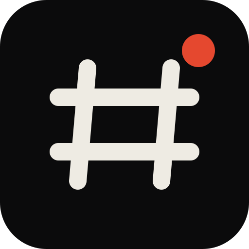

[](https://www.npmjs.com/package/@jtalk22/slack-mcp)&nbsp;[](https://www.npmjs.com/package/@jtalk22/slack-mcp)&nbsp;[](https://github.com/jtalk22/slack-mcp-server/actions/workflows/ci.yml)&nbsp;[](#provenance-dont-take-my-word-for-it)&nbsp;[](https://registry.modelcontextprotocol.io)

<div align="center">



<p><strong>SLACK’S OPERATING LAYER FOR AI AGENTS</strong></p>

<h1>Slack MCP Server</h1>

<h2>Ask what happened. Get receipts. Close the loop.</h2>

<p>Turn Slack from an interruption stream into searchable operating memory and approved action. The open-source local path ships <strong>21 tools today</strong> through the browser session you already have—no Slack app, scope review, or admin queue. Hosted adds permanent OAuth, indexing, scheduled intelligence, and team continuity when the workflow must run without you.</p>

<p><strong>If you can read it in Slack, your agent can read it too.</strong></p>

</div>

```bash
npx -y @jtalk22/slack-mcp --setup
```

<div align="center">

<p><kbd>Claude Code</kbd> <kbd>Claude Desktop</kbd> <kbd>Cursor</kbd> <kbd>Copilot</kbd> <kbd>Windsurf</kbd> <kbd>Gemini CLI</kbd> <kbd>Codex CLI</kbd> <kbd>any stdio MCP client</kbd></p>

<a href="https://jtalk22.github.io/slack-mcp-server/public/demo-video.html">
  
</a>

<p><strong><a href="https://jtalk22.github.io/slack-mcp-server/public/demo-video.html">▶ It’s Monday, 9:07—watch what blew up overnight</a></strong> · <a href="https://jtalk22.github.io/slack-mcp-server/public/demo-slack-mcp.html">interactive walkthrough</a> · <a href="docs/SETUP.md">setup guide</a></p>

</div>

<p align="center">
  <a href="#built-past-the-demo">The moat</a> ·
  <a href="#two-ways-into-slack">Why session auth</a> ·
  <a href="#install">Install</a> ·
  <a href="#21-tools-read-act-automate">21 tools</a> ·
  <a href="#typed-workflows-slack-in-json-out">Workflows</a> ·
  <a href="#free-local-when-youre-driving-hosted-when-it-must-drive-itself">Local vs hosted</a>
</p>

---

## It’s Monday, 9:07. Slack has already formed opinions.

The demo starts where a real workday starts: unread DMs, an incident channel, product chatter, and engineering follow-ups competing for attention.

| Signal | What the agent does | What comes back |
|---|---|---|
| `23 unread` in `#incidents` | Reads the relevant history and thread | The P1, owner, resolution, and remaining risk |
| A five-month printer mystery | Searches across the workspace | The exact `#facilities` message, with channel and context |
| A thread that needs closure | Replies, reacts, or marks it read | The loop is closed without opening Slack |

This is not screenshot automation. The agent calls Slack through a real MCP tool surface and receives typed results it can search, summarize, export, or act on.

---

## From one question to recurring operations

| Who | Job to be done | Best starting path |
|---|---|---|
| Developer or solo operator | Give an agent real Slack context and approved actions now, without waiting on app governance | **Local / MIT** |
| Engineering or operations lead | Reconstruct incidents, recover decisions, hand off ownership, and clear the morning queue | **Local or Hosted** |
| Support, product, or executive team | Turn channel sets into typed support, launch, incident, or executive briefs | **Hosted for schedules and indexing** |
| Business running unattended workflows | Keep retrieval and briefs alive across token rotation, users, and workspaces | **Hosted / permanent OAuth** |

The local product is complete, not a crippled trial. Hosted earns the upgrade through continuity, intelligence, and collaboration—not by holding ordinary Slack access hostage.

---

## Built past the demo

### 1. The browser-session engine

`--setup` turns the Slack identity Chrome already holds into a local MCP server:

- finds the newest `xoxc-` token in Chrome's on-disk LevelDB;
- snapshots the cookie SQLite database with its WAL sidecars;
- retrieves Chrome Safe Storage from the macOS Keychain;
- runs Chrome-compatible PBKDF2 + AES-128-CBC decryption locally;
- requires no DevTools, clipboard step, browser flag, or live Slack tab;
- names the failed extraction stage—`keychain_timeout`, `no_slack_cookie_row`, `cookie_decrypt_failed`, and more—instead of returning one opaque error.

The code is plain JavaScript in this repository. Audit it before trusting it with a session.

### 2. Credential lifecycle, not credential paste

Session credentials rotate. The server is built around that reality:

- `auto`, `keychain-only`, and `file` storage backends;
- owner-only token files and a Keychain-only path with no plaintext credentials on disk;
- atomic file writes, verified Keychain migration, cross-process locks, and refresh mutexes;
- proactive health checks and automatic macOS refresh;
- last-known-good in-memory credentials when persistence is temporarily unavailable;
- isolated profiles for work and personal Slack;
- fail-closed handling for invalid storage or profile configuration.

### 3. Full-fidelity Slack reads

Read DMs and channels, search the workspace, export complete histories with threads, inspect unread state, and resolve users. Opt into blocks, attachments, files, reactions, metadata, and bot/app markers when text alone is not the real message.

### 4. The agent can finish the job

Send a reply, add or remove a reaction, and mark a conversation read. Every workspace write path carries an MCP destructive annotation so compatible clients can put approval where it belongs.

### 5. Slack in, typed JSON out

Save workflow profiles for incident rooms, executive briefs, support inboxes, launch watches, and custom operations. The OSS primitives are local JSON; the optional hosted brain renders them into contract-shaped briefs.

---

## Two ways into Slack

Slack already knows who you are. The question is how your agent gets there.

<div align="center">
  
</div>

| | Slack official MCP | **Slack MCP Server — local** |
|---|---|---|
| Starting point | A Slack-managed remote integration | The Slack session already in Chrome |
| Workspace control | Governed by workspace integration settings | **No Slack app or admin request for the local path** |
| Transport | Streamable HTTP | **Local stdio** |
| Client surface | Slack's supported partner integrations | **Any stdio MCP client** |
| Authentication | OAuth | **Existing browser session** |
| Credential lifetime | Managed OAuth | Rotating session with health checks and refresh |
| Product surface | Broad Slack-native capabilities | **21 focused tools across read, act, and automate** |
| Runtime | Slack-managed | **MIT code on your machine** |

Same Slack identity. Same underlying permissions. A radically shorter path from your workspace to your agent.

Slack's official surface has evolved and is a strong fit for organization-sanctioned deployments. Its current capabilities and supported clients are documented by [Slack](https://docs.slack.dev/ai/slack-mcp-server/); workspace integration settings remain under [admin control](https://docs.slack.dev/ai/slackbot-mcp-client/admin-approval/). This project is the direct local path when you need useful Slack access now, in the clients you already use.

<details>
<summary><strong>Is the local path against Slack's terms?</strong></summary>
<br>

Treat browser-session automation as an acceptable-use decision for you and your workspace. The server acts as your signed-in Slack identity and cannot read a channel you cannot read or act as another user. It does not evade server-side retention, DLP, compliance exports, or audit controls.

"No admin request" means there is no Slack app installation to approve. It does not mean workspace activity disappears from Slack's systems. If your policy requires a sanctioned OAuth integration, use the official MCP or the optional [hosted OAuth path](https://mcp.revasserlabs.com).
</details>

---

## Install

**Node 22 or 24 recommended. Node 20 remains supported for the v4 line.**

Fastest path—run setup without installing a global command:

```bash
npx -y @jtalk22/slack-mcp --setup
```

Prefer a persistent CLI:

```bash
npm install -g @jtalk22/slack-mcp
slack-mcp --setup
```

Then:

1. Pick your client in the [setup guide](docs/SETUP.md).
2. Register the generated stdio command.
3. Fully restart the client.
4. Ask the agent to run `slack_health_check`.
5. A workspace name in the response means the connection is live.

| Client | Configuration surface | Status |
|---|---|---|
| Claude Code | `claude mcp add` or `~/.claude.json` | Documented |
| Claude Desktop | Desktop MCP configuration | Verified |
| Cursor | `.cursor/mcp.json` | Documented |
| GitHub Copilot | `.vscode/mcp.json` | Documented |
| Windsurf | `~/.codeium/windsurf/mcp_config.json` | Documented |
| Gemini CLI | `~/.gemini/settings.json` | Documented |
| Codex CLI | `codex mcp add` or `~/.codex/config.toml` | Documented |
| Other clients | Any stdio MCP configuration | Protocol-compatible |

Use the same server command everywhere:

```json
{
  "command": "npx",
  "args": ["-y", "@jtalk22/slack-mcp"]
}
```

On macOS, setup can extract from Chrome and persist the selected storage backend. On other platforms, provide `SLACK_TOKEN` and `SLACK_COOKIE` through the client's environment configuration. Docker, HTTP, and detailed client examples live in [docs/SETUP.md](docs/SETUP.md) and [docs/DEPLOYMENT-MODES.md](docs/DEPLOYMENT-MODES.md).

---

## 21 tools: read, act, automate

### 12 read-only Slack operations

| Tool | Purpose |
|---|---|
| `slack_health_check` | Verify credentials and workspace identity |
| `slack_token_status` | Inspect credential age, health, cache, profile, and storage state |
| `slack_refresh_tokens` | Refresh local credentials from the browser session on macOS*—reads Slack, writes only local state |
| `slack_list_conversations` | List channels and DMs |
| `slack_conversations_history` | Read channel or DM history with optional rich fields |
| `slack_get_full_conversation` | Export complete history and threads |
| `slack_search_messages` | Search across the workspace |
| `slack_get_thread` | Read all replies in a thread |
| `slack_users_info` | Resolve a user |
| `slack_list_users` | Page through large workspace directories |
| `slack_users_search` | Search users by name, display name, or email |
| `slack_conversations_unreads` | Prioritize conversations with unread messages |

### Act in the workspace — 4 write-path tools

| Tool | Purpose | MCP safety |
|---|---|---|
| `slack_send_message` | Send to a channel or DM | destructive |
| `slack_add_reaction` | Add an emoji reaction | destructive |
| `slack_remove_reaction` | Remove an emoji reaction | destructive |
| `slack_conversations_mark` | Mark a conversation read | destructive |

### Automate locally — 2 workflow primitives

| Tool | Purpose |
|---|---|
| `slack_workflow_save` | Save a typed workflow profile to `~/.slack-mcp-workflows.json` |
| `slack_workflows` | List saved workflow profiles |

### Discover hosted intelligence — 3 explicit stubs

| Tool | Hosted result |
|---|---|
| `slack_smart_search` | Semantic + lexical search over indexed Slack history |
| `slack_catch_me_up` | Structured catch-up against a saved workflow profile |
| `slack_triage` | Prioritized action queue with routing recommendations |

The OSS stubs make the hosted capability discoverable and return a structured upgrade payload; they do not make a Slack call. `slack_refresh_tokens` only writes local credential state. Complete inputs and response contracts live in [docs/API.md](docs/API.md).

---

## Typed workflows: Slack in, JSON out

Bind a workflow kind to channels, priority people, retention, and cadence:

```bash
npx -y @jtalk22/slack-mcp --apply-template oncall-handoff --channels C012345,C067890
```

| Workflow kind | Contract |
|---|---|
| `incident_room` | `{incident_summary, timeline, open_risks, owner_gaps, next_actions}` |
| `exec_brief` | `{summary, decisions, risks, asks, action_items}` |
| `support_inbox` | `{open_threads, ack_lag, owner_gaps, escalations, next_actions}` |
| `product_launch_watch` | `{launch_signals, feedback_themes, blockers, metrics, next_actions}` |
| `custom` | `{summary, highlights, open_questions, next_actions}` |

Six editable templates ship in the package: `oncall-handoff`, `support-triage`, `exec-monday`, `sprint-tracker`, `customer-feedback`, and `incident-room`.

The local profile primitives remain free. Hosted performs the indexed retrieval and contract-validated summarization required to turn those profiles into durable scheduled operations.

---

## Rich messages are not just `text`

Four read tools accept `include_rich_message_fields: true`, surfacing attachments, blocks, files, reactions, metadata, subtype, bot/app markers, and workspace identity.

```json
{
  "ts": "1767368030.607599",
  "user": "incident-bot",
  "text": "",
  "subtype": "bot_message",
  "attachments": [{ "title": "PagerDuty", "text": "P1 — API latency > 2s" }]
}
```

This changes output shape, not permissions. Rich fields are opt-in to protect client context. Slack search results do not carry every rich field; use search to find the hit, then history or thread tools to retrieve the full payload.

---

## Where credentials live

Resolution is deterministic; first hit wins:

1. `SLACK_TOKEN` + `SLACK_COOKIE`
2. token file (`chmod 600`)
3. macOS Keychain
4. Chrome extraction on macOS

| Mode | Behavior |
|---|---|
| `auto` | Token file plus Keychain backup |
| `keychain-only` | Keychain only; verified writes and no plaintext credential file |
| `file` | Owner-only token file; Keychain is never touched |

The selected backend is remembered in non-secret metadata and used by the server, CLI, and optional refresh job. An unrecognized mode fails at startup instead of silently downgrading storage.

Session credentials commonly rotate after one or two weeks. When Slack returns `invalid_auth`, `not_authed`, `token_expired`, `token_revoked`, `account_inactive`, or HTTP 401, the server gives the local recovery command first:

```bash
npx -y @jtalk22/slack-mcp --setup
```

On macOS, `slack_refresh_tokens` or `npx -y @jtalk22/slack-mcp --refresh-tokens` refreshes without leaving the client. The optional LaunchAgent in [docs/SETUP.md](docs/SETUP.md) keeps long-idle installations healthy.

### Multiple workspaces

```json
{
  "mcpServers": {
    "slack-work": {
      "command": "npx",
      "args": ["-y", "@jtalk22/slack-mcp"],
      "env": { "SLACK_MCP_PROFILE": "work" }
    },
    "slack-personal": {
      "command": "npx",
      "args": ["-y", "@jtalk22/slack-mcp"],
      "env": { "SLACK_MCP_PROFILE": "personal" }
    }
  }
}
```

Each profile gets its own token file, Keychain entries, metadata, and lock. Add `SLACK_MCP_CHROME_PROFILE` when the workspaces live in different Chrome profiles.

---

## Free local when you’re driving. Hosted when it must drive itself.

When local control is enough, stop here. Everything above is MIT-licensed and runs on your machine.

The split is operational: local is the fastest route to control; hosted is the route to unattended business workflows. Hosted exists for work that must survive a rotating browser session:

- permanent OAuth;
- indexed semantic search;
- scheduled catch-up and triage;
- contract-validated workflow briefs;
- shared profiles and managed workspace continuity.

| Tier | Price | Adds |
|---|---:|---|
| Self-host | Free | Current local surface—21 tools today—and workflow-profile primitives |
| Hosted Free | $0, no card | 1 workspace, 2,000 requests/month, 25 AI calls/month, 7-day index |
| Pro | $19/month or $190/year | Unlimited requests and AI calls under fair use, permanent OAuth, 2 workspaces |
| Team | $49/month flat or $490/year | Shared workflow profiles, 5 workspaces, 24-hour support |
| Safeguard | $199/month, waitlist | Approval gates, scheduled catch-up DM, workspace memory—in development |

[See live hosted pricing →](https://mcp.revasserlabs.com/pricing)

---

## Security and provenance

- Credential files are owner-only.
- Keychain-only mode keeps plaintext credentials off disk.
- Configuration fails closed for unknown storage modes and invalid profiles.
- Writes are atomic and shared credential state is process-locked.
- The local web server binds to localhost.
- Workspace write tools carry destructive annotations.
- Every release publishes from CI with npm provenance.

### Provenance: don't take my word for it

```bash
npm audit signatures
```

A clean result verifies that the package signatures and attestations trace back through the published release chain. Inspect the package before handing it a live Slack session.

Full policy: [SECURITY.md](SECURITY.md).

---

## Documentation

[Setup](docs/SETUP.md) · [API](docs/API.md) · [Architecture](docs/ARCHITECTURE.md) · [Compatibility](docs/COMPATIBILITY.md) · [Deployment modes](docs/DEPLOYMENT-MODES.md) · [Recipes](docs/USE_CASE_RECIPES.md) · [Troubleshooting](docs/TROUBLESHOOTING.md) · [Roadmap](docs/ROADMAP.md)

## Contributing

PRs are welcome. Read [CONTRIBUTING.md](CONTRIBUTING.md) and run `node --check` on touched JavaScript before submitting.

## License

MIT — see [LICENSE](LICENSE).

## Disclaimer

Not affiliated with Slack Technologies, Inc. This server uses browser-session credentials. Review your workspace's acceptable-use policy before running it.

---

<div align="center">

### Your Slack. Your agent. One command.

```bash
npx -y @jtalk22/slack-mcp --setup
```

If this removes a Slack tab from your day, [star the repository](https://github.com/jtalk22/slack-mcp-server). Stars are how the next admin-blocked developer finds the local path.

</div>
