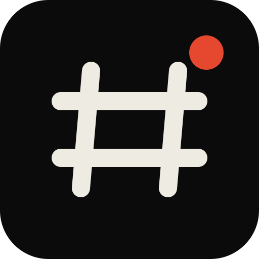
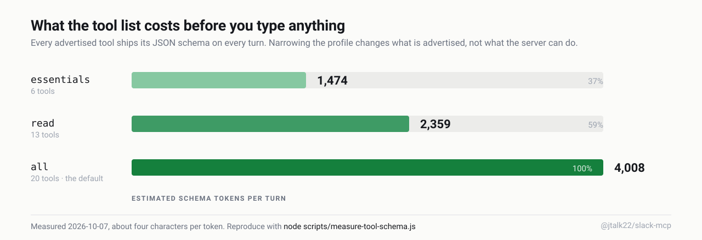
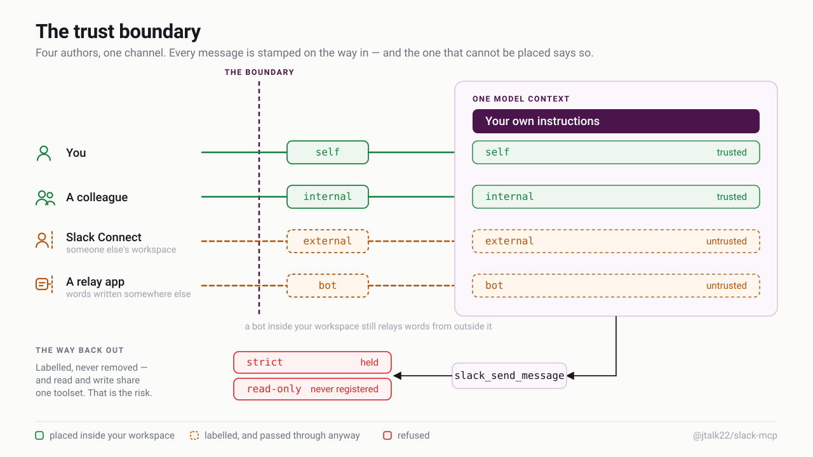

<div align="center">

[](https://www.npmjs.com/package/@jtalk22/slack-mcp)&nbsp;[](https://npm-stat.com/charts.html?package=%40jtalk22%2Fslack-mcp)&nbsp;[](https://www.npmjs.com/package/@jtalk22/slack-mcp)&nbsp;[](https://nodejs.org)&nbsp;[](LICENSE)

[](https://github.com/jtalk22/slack-mcp-server/pkgs/container/slack-mcp-server)&nbsp;[](https://registry.modelcontextprotocol.io/v0/servers/io.github.jtalk22%2Fslack-mcp-server/versions/latest)&nbsp;[](https://github.com/jtalk22/slack-mcp-server/actions/workflows/ci.yml)&nbsp;[](#provenance-dont-take-my-word-for-it)



<h1>Slack MCP Server</h1>

<h3>Catch up on Slack without reading it.</h3>

<p>Unreads, threads, and search — in your agent’s context, from the session you already have.</p>

<p><a href="https://jtalk22.github.io/slack-mcp-server/public/demo-video.html"></a></p>

</div>

**Set it up, then register it with your client.**

```sh
npx -y @jtalk22/slack-mcp --setup
```

```sh
claude mcp add slack -- npx -y @jtalk22/slack-mcp
```

Check where your credentials are stored and how old they are, or run it read-only so your agent can read Slack but never post.

```sh
npx -y @jtalk22/slack-mcp --doctor --security
```

```sh
npx -y @jtalk22/slack-mcp --read-only
```

On **Enterprise Grid**, Slack can end a session it sees being automated. Use [Slack's official MCP server](https://docs.slack.dev/ai/slack-mcp-server/) there.

<p align="center"><kbd>Claude Code</kbd> <kbd>Claude Desktop</kbd> <kbd>Cursor</kbd> <kbd>Copilot</kbd> <kbd>Windsurf</kbd> <kbd>Gemini CLI</kbd> <kbd>Codex CLI</kbd> <kbd>any stdio MCP client</kbd></p>

<p align="center"><a href="CHANGELOG.md#510---2026-10-07"><strong>What’s new in 5.1</strong></a> · <a href="https://jtalk22.github.io/slack-mcp-server/public/demo-video.html">▶ the whole morning in three minutes</a> · <a href="https://jtalk22.github.io/slack-mcp-server/public/demo-slack-mcp.html">interactive walkthrough</a> · <a href="docs/SETUP.md">setup guide</a></p>

---

## If your workspace is on Slack's free plan

Checked against Slack's published plans and pricing on 2026-10-07.

A free workspace keeps 90 days of message history, allows 10 app integrations, and gets only Slack's basic AI. The AI people actually want — AI search across the workspace, channel recaps, Slackbot acting as an agent, AI workflow generation — starts on Business+ at $15 per user per month on annual billing ($18 month to month). Pro, at $7.25, buys unlimited history and unlimited apps, not the advanced AI. So a ten-person free workspace that wants an AI it can ask about its own Slack is looking at $1,800 a year, and the cheaper upgrade does not get them there.

This package gives that workspace an agent over the same Slack for nothing, running on the AI subscription its people already pay for. Three things follow from how it works:

- **It installs no Slack app, so it uses none of your 10 app slots.** If your workspace is already at the cap, this is the only way left to add an integration at all.
- **It needs no admin approval**, because it is not an app anyone has to approve. It reads Slack through your own browser session, with exactly the access you already have and nothing more.
- **It can export what you can still see.** On a free plan, history older than 90 days stops being reachable — Slack's own free export covers public channels only and is admin-only, so DMs and private channels are not in it. `slack_get_full_conversation` writes them out with their threads while they are still inside the window. It cannot retrieve anything already past the line; nothing can.

The browser-session route is not a workaround to apologise for. For a workspace Slack's own AI does not serve, it is the only route there is.

---

## Two ways into Slack

[Slack's official MCP server](https://docs.slack.dev/ai/slack-mcp-server/) is an app your workspace admin [approves and controls](https://docs.slack.dev/ai/slackbot-mcp-client/admin-approval/). Use it when your organisation wants a sanctioned integration. This server uses the browser session already in Chrome instead, so there is no app to install and no admin to ask, and it runs as a local command for any stdio MCP client. It acts as you, with exactly your access.

<details>
<summary><strong>Side by side: the managed integration path vs. the local session path</strong></summary>
<br>

| | Slack official MCP | **Slack MCP Server — local** |
|---|---|---|
| Starting point | A Slack-managed remote integration | The Slack session already in Chrome |
| Workspace control | Governed by workspace integration settings | **No Slack app or admin request for the local path** |
| Transport | Streamable HTTP | **Local stdio** |
| Client surface | Slack's supported partner integrations | **Any stdio MCP client** |
| Authentication | OAuth | **Existing browser session** |
| Credential lifetime | Managed OAuth | Rotating session with health checks and refresh |
| Product surface | Broad Slack-native capabilities | **20 tools across read, act, and automate** |
| Protocol | Slack-managed | **MCP 2026-07-28 and every 2025 revision, from the same binary** |
| Runtime | Slack-managed | **MIT code on your machine** |

</details>

<details>
<summary><strong>Is the local path against Slack's terms?</strong></summary>
<br>

Treat browser-session automation as an acceptable-use decision for you and your workspace. The server acts as your signed-in Slack identity and cannot read a channel you cannot read or act as another user. It does not evade server-side retention, DLP, compliance exports, or audit controls.

"No admin request" means there is no Slack app installation to approve. It does not mean workspace activity disappears from Slack's systems. If your policy requires a sanctioned integration, use Slack's official MCP server.
</details>

---

## Install

**Node 22 or 24 recommended. Node 20+ is supported and CI-tested.**

```bash
npx -y @jtalk22/slack-mcp --setup
```

Prefer a persistent CLI: `npm install -g @jtalk22/slack-mcp` then `slack-mcp --setup`.

Then:

1. Copy the stdio command `--setup` prints when it finishes.
2. Paste it into your client, or run the `claude mcp add` line it prints.
3. Fully restart the client.
4. Ask the agent to run `slack_health_check`.
5. A workspace name in the response means the connection is live.

Per-client configuration keys are in the [setup guide](docs/SETUP.md).

Use the same server command everywhere:

```json
{
  "command": "npx",
  "args": ["-y", "@jtalk22/slack-mcp"]
}
```

On macOS, setup can extract from Chrome and persist the selected storage backend. On other platforms, provide `SLACK_TOKEN` and `SLACK_COOKIE` through the client's environment configuration. Docker, HTTP, and detailed client examples live in [docs/SETUP.md](docs/SETUP.md) and [docs/DEPLOYMENT-MODES.md](docs/DEPLOYMENT-MODES.md).

<details>
<summary><strong>Client configuration matrix</strong></summary>
<br>

| Client | Configuration surface | Status |
|---|---|---|
| Claude Code | `claude mcp add` or `~/.claude.json` | Documented |
| Claude Desktop | Desktop MCP configuration | Verified |
| Cursor | `.cursor/mcp.json` | Documented |
| GitHub Copilot | `.vscode/mcp.json` | Documented |
| Windsurf | `~/.codeium/windsurf/mcp_config.json` | Documented |
| Gemini CLI | `~/.gemini/settings.json` | Documented |
| Codex CLI | `codex mcp add` or `~/.codex/config.toml` | Documented |
| Other clients | Any stdio MCP configuration | Protocol-compatible |

</details>

---

## 20 tools: read, act, automate

Read channels, DMs, threads and search; act with a reply, a reaction or a read-state change; run the catch-up and typed workflows locally. The surface is **20 tools** today: **13 read-only** operations, **4 write-path** tools that each carry an MCP destructive annotation so clients can gate workspace writes, and 3 local workflow tools. One of the reads is `slack_session_report`, which reads nothing from Slack: it returns what this process has done, as counts. Every tool does its work here — reads Slack or local state — and none is a placeholder for something you would have to pay for. Four read tools accept `include_rich_message_fields: true` to surface attachments, blocks, files, reactions, and metadata—complete inputs and response contracts live in [docs/API.md](docs/API.md).

Speaks MCP **2026-07-28** and every 2025 revision from the same binary — era-negotiated over stdio, stateless per request over HTTP (no `Mcp-Session-Id`; `GET`/`DELETE` answer 405). The claim is a test, not a sentence: [`test/mcp-era.test.js`](test/mcp-era.test.js) drives the real SDK client at both eras against the real entry points.

<p align="center">
</p>

**Advertising fewer tools.** Every tool the server advertises sends its schema to the model on every turn, before you ask anything. `SLACK_MCP_TOOLS=essentials` advertises six (unread, history, search, thread, user lookup, send); `SLACK_MCP_TOOLS=read` the 13 read-only operations; `--tools=slack_x,slack_y` an explicit set. The default is all 20. Filtering changes what is advertised, not what is callable.



<details>
<summary><strong>The full tool inventory</strong></summary>
<br>

### 13 read-only operations

| Tool | Purpose |
|---|---|
| `slack_health_check` | Verify credentials and workspace identity |
| `slack_token_status` | Inspect credential age, health, cache, profile, and storage state |
| `slack_refresh_tokens` | Refresh local credentials from the browser session on macOS—reads Slack, writes only local state |
| `slack_list_conversations` | List channels and DMs |
| `slack_conversations_history` | Read channel or DM history with optional rich fields |
| `slack_get_full_conversation` | Export complete history and threads |
| `slack_search_messages` | Search across the workspace |
| `slack_get_thread` | Read all replies in a thread |
| `slack_users_info` | Resolve a user |
| `slack_list_users` | Page through large workspace directories |
| `slack_users_search` | Search users by name, display name, or email |
| `slack_conversations_unreads` | Prioritize conversations with unread messages |

### Act in the workspace — 4 write-path tools

| Tool | Purpose | MCP safety |
|---|---|---|
| `slack_send_message` | Send to a channel or DM | destructive |
| `slack_add_reaction` | Add an emoji reaction | destructive |
| `slack_remove_reaction` | Remove an emoji reaction | destructive |
| `slack_conversations_mark` | Mark a conversation read | destructive |

### Automate locally — 3 workflow tools

| Tool | Purpose |
|---|---|
| `slack_workflow_save` | Save a typed workflow profile to `~/.slack-mcp-workflows.json` |
| `slack_workflows` | List saved workflow profiles |
| `slack_catch_me_up` | Read a profile's channels since its cadence window and return structured catch-up evidence |

`slack_refresh_tokens` reads Slack and writes only local credential state.

</details>

---

## Typed workflows: Slack in, JSON out

Bind a workflow kind to channels, priority people, retention, and cadence. `slack_catch_me_up` then reads that scope locally and hands your agent the evidence: which threads went unanswered and for how long, what your priority people said or were pinned on, which conversations actually moved. It does the gathering; your agent writes the summary against the contract below.

There is no server-side model in that path, because there does not need to be one — the client calling this server is already a language model. Hosted adds what needs a server: running the same catch-up on a schedule while your laptop is shut.

```bash
npx -y @jtalk22/slack-mcp --apply-template oncall-handoff --channels C012345,C067890
```

<details>
<summary><strong>Workflow contracts and shipped templates</strong></summary>
<br>

| Workflow kind | Contract |
|---|---|
| `incident_room` | `{incident_summary, timeline, open_risks, owner_gaps, next_actions}` |
| `exec_brief` | `{summary, decisions, risks, asks, action_items}` |
| `support_inbox` | `{open_threads, ack_lag, owner_gaps, escalations, next_actions}` |
| `product_launch_watch` | `{launch_signals, feedback_themes, blockers, metrics, next_actions}` |
| `custom` | `{summary, highlights, open_questions, next_actions}` |

Six editable templates ship in the package: `oncall-handoff`, `support-triage`, `exec-monday`, `sprint-tracker`, `customer-feedback`, and `incident-room`.

</details>

---

## Security and provenance

Every message this server returns becomes text in a model's context, next to your own instructions. Slack is a shared bus: a channel can hold Slack Connect participants from another workspace, guests, and apps relaying content from outside Slack entirely — and the same toolset that reads also writes. That adjacency is the risk worth naming.

- Credential files are owner-only; Keychain-only mode keeps plaintext credentials off disk.
- Configuration fails closed for unknown storage modes and invalid profiles.
- Writes are atomic and shared credential state is process-locked.
- The local web server binds to localhost; workspace write tools carry destructive annotations.
- Every release publishes from CI with npm provenance.

<p align="center">
  
</p>

<details>
<summary><strong>Author labels on every message</strong></summary>

Each message carries `origin` (`self`, `internal`, `external`, `bot`, `unknown`) and `author_trusted`, derived from fields Slack already returns, so it costs no extra API call. `bot` outranks workspace membership, because an app inside your workspace routinely relays words written outside it. A batch containing outside authors carries an `untrusted_content` envelope naming the count.

It fails closed: an author this server cannot positively place inside your workspace is reported untrusted. The exception is a conversation Slack reports as not shared with any other workspace — one of those structurally cannot hold an outside author, so a colleague with no team id on their message is called internal rather than unknown. When that lookup fails, the label stays unknown.

`SLACK_MCP_PROVENANCE=off|label|strict`. `label` is the default and only adds keys. A per-call `provenance` argument may tighten the mode and never loosen it, because a caller asking for fewer labels may be repeating something it read.

</details>

<details>
<summary><strong>What the labels cannot do</strong></summary>

A label is advice to the model reading it. It is unsigned, it can be stripped by anything downstream, and it raises the cost of an injected instruction without making one impossible.

`strict` mode additionally holds `slack_send_message` once the session has read outside-authored text. The hold is released by `confirm_untrusted_context`, which the caller sets — so it interrupts the send and puts it on the record, but it cannot prove a human approved it.

Two surfaces are still unlabelled, and knowing that is better than assuming otherwise: user display names, real names and titles from the user tools, and channel topics and purposes from `slack_list_conversations`, are attacker-settable free text that reaches the model without an origin stamp.

</details>

<details>
<summary><strong>Read-only mode, for when a label is not enough</strong></summary>

```bash
npx -y @jtalk22/slack-mcp --read-only          # or SLACK_MCP_READ_ONLY=1
```

The four write-path tools are withheld from `tools/list` *and* refused at dispatch, because a client can call a name it was never offered. The filter is applied after the tool profile resolves, so no profile or custom tool list widens it back. An absent tool needs no trust in the model that would have called it.

</details>

<details>
<summary><strong>The receipt</strong></summary>

`slack_session_report` returns what this process actually did: messages read, how many were outside-authored and by which origin, writes attempted, writes held. Counts only — no message text, no channel name, no user id. A label is a claim about one message; this is the claim about the session, and it is how you check afterwards whether outside text reached the model and whether anything tried to send on the back of it.

</details>

### Verify the release

```bash
npm audit signatures
```

A clean result means the package you installed was built and signed by this repository's release workflow. Read the code before giving it your Slack session. Full policy: [SECURITY.md](.github/SECURITY.md).

---

## How it works

Five parts sit under the tools: extraction from Chrome, credential storage, reads, writes, and typed workflow output. All of it is plain JavaScript in this repository.

<details>
<summary><strong>The five parts</strong></summary>
<br>

### 1. Extraction from Chrome

`--setup` turns the Slack identity Chrome already holds into a local MCP server:

- finds the newest `xoxc-` token in Chrome's on-disk LevelDB;
- snapshots the cookie SQLite database with its WAL sidecars;
- retrieves Chrome Safe Storage from the macOS Keychain;
- runs Chrome-compatible PBKDF2 + AES-128-CBC decryption locally;
- requires no DevTools, clipboard step, browser flag, or live Slack tab;
- names the failed extraction stage—`keychain_timeout`, `no_slack_cookie_row`, `cookie_decrypt_failed`, and more—instead of returning one opaque error.

### 2. Credential storage

Slack session credentials rotate. The server handles that with:

- `auto`, `keychain-only`, and `file` storage backends;
- owner-only token files and a Keychain-only path with no plaintext credentials on disk;
- atomic file writes, verified Keychain migration, cross-process locks, and refresh mutexes;
- proactive health checks and automatic macOS refresh;
- last-known-good in-memory credentials when persistence is temporarily unavailable;
- isolated profiles for work and personal Slack;
- fail-closed handling for invalid storage or profile configuration.

### 3. Reads

Read DMs and channels, search the workspace, export complete histories with threads, inspect unread state, and resolve users. Opt into blocks, attachments, files, reactions, metadata, and bot/app markers when text alone is not the real message.

### 4. Writes

Send a reply, add or remove a reaction, and mark a conversation read. Every write tool carries MCP's destructive annotation, so compatible clients ask before running it.

### 5. Typed workflow output

Save workflow profiles for incident rooms, executive briefs, support inboxes, launch watches, and your own. Profiles are local JSON; the hosted tier can deliver them as scheduled briefs.

</details>

---

## Credentials

The server checks these in order and uses the first it finds.

| | Source | Where it comes from |
|---|---|---|
| 1 | `SLACK_TOKEN` + `SLACK_COOKIE` | your client's environment configuration |
| 2 | Token file | written by `--setup`, `chmod 600` |
| 3 | macOS Keychain | written by `--setup` |
| 4 | Chrome extraction | macOS only, run on demand |

Session credentials expire, and how long they last varies: one written on 2026-07-04 still worked on 2026-10-07. `slack_token_status` shows the age of yours. When Slack rejects it (`invalid_auth`, `not_authed`, `token_expired`, `token_revoked`, `account_inactive` or HTTP 401), run `npx -y @jtalk22/slack-mcp --setup`. On macOS, `slack_refresh_tokens` or `--refresh-tokens` refreshes without leaving your client, and the optional LaunchAgent in [docs/SETUP.md](docs/SETUP.md) keeps an idle install working.

<details>
<summary><strong>Enterprise Grid, extraction, and caching</strong></summary>
<br>

**Enterprise Grid.** Grid runs aggressive session-anomaly detection. Browser-session automation can trip it, which flags the session and kills it, regardless of which tool drives the traffic. Outbound calls are paced by default to stay under burst thresholds (`SLACK_MCP_MIN_REQUEST_INTERVAL_MS`, default 350; `SLACK_MCP_MAX_CONCURRENCY`, default 3). Pacing lowers that risk; it does not remove it. On Grid, use Slack's official MCP server.

**Credential extraction.** `--setup` reads the newest `xoxc-` token from Chrome's on-disk LevelDB, snapshots the cookie SQLite database, retrieves Chrome Safe Storage from the macOS Keychain, and runs PBKDF2 + AES-128-CBC decryption locally. It writes the token file, Keychain entries, and non-secret metadata. It transmits nothing — the server talks to Slack and nowhere else.

**This is the same access pattern credential stealers use.** Chrome App-Bound Encryption exists to make this class of read harder, and infostealer families (Lumma, Vidar, Meduza) bypass it to lift live sessions. The mechanism here is comparable. What differs is that you run it, on your own machine, against your own session, and nothing leaves the host. The source is plain JavaScript in this repository; audit it before handing it a live session.

**User cache.** One cache exists: user-name lookups, populated on demand, 500 entries maximum, one-hour TTL. No message content, no channel history, and no persistent copy of the workspace is stored.

</details>

<details>
<summary><strong>Storage modes and multi-workspace profiles</strong></summary>
<br>

| Mode | Behavior |
|---|---|
| `auto` | Token file plus Keychain backup |
| `keychain-only` | Keychain only; verified writes and no plaintext credential file |
| `file` | Owner-only token file; Keychain is never touched |

The selected backend is remembered in non-secret metadata and used by the server, CLI, and optional refresh job. An unrecognized mode fails at startup instead of silently downgrading storage.

```json
{
  "mcpServers": {
    "slack-work": {
      "command": "npx",
      "args": ["-y", "@jtalk22/slack-mcp"],
      "env": { "SLACK_MCP_PROFILE": "work" }
    },
    "slack-personal": {
      "command": "npx",
      "args": ["-y", "@jtalk22/slack-mcp"],
      "env": { "SLACK_MCP_PROFILE": "personal" }
    }
  }
}
```

Each profile gets its own token file, Keychain entries, metadata, and lock. Add `SLACK_MCP_CHROME_PROFILE` when the workspaces live in different Chrome profiles.

</details>

---

## Local and hosted

The package runs on your machine, talks only to Slack, and is free under the MIT license. The hosted tier runs on a schedule instead, so the brief arrives while your laptop is closed:

- catch-up on a schedule, in your timezone;
- briefs built from your saved workflow profiles;
- profiles shared across a team;
- delivery to Slack or a signed webhook.

The package works without the hosted tier.

[Hosted pricing →](https://mcp.revasserlabs.com/pricing)

---

## Documentation

[Setup](docs/SETUP.md) · [API](docs/API.md) · [Architecture](docs/ARCHITECTURE.md) · [Compatibility](docs/COMPATIBILITY.md) · [Deployment modes](docs/DEPLOYMENT-MODES.md) · [Recipes](docs/USE_CASE_RECIPES.md) · [Troubleshooting](docs/TROUBLESHOOTING.md) · [Roadmap](docs/ROADMAP.md)

## Contributing

PRs are welcome. Read [CONTRIBUTING.md](.github/CONTRIBUTING.md) and run `node --check` on touched JavaScript before submitting.

## License

MIT — see [LICENSE](LICENSE).

## Disclaimer

Not affiliated with Slack Technologies, Inc. This server uses browser-session credentials. Review your workspace's acceptable-use policy before running it.

---

<div align="center">

**Your Slack. Your agent. One command.**

If this removes a Slack tab from your day, [star the repository](https://github.com/jtalk22/slack-mcp-server). Stars are how the next admin-blocked developer finds the local path.

</div>
